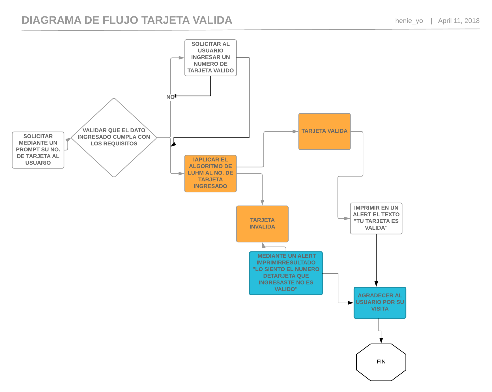

 ## Tarjeta de Credito Valida
 ### Requerimientos
 Crear una web que pida, por medio de un prompt(), el número de una tarjeta de crédito y confirme su validez según el algoritmo de Luhn.

Consideraciones Específicas

Tu código debe estar compuesto por 1 función: isValidCard
El usuario no debe poder ingresar un campo vacío

Para generar el dígito de verificación empleando el algoritmo de Luhn se deben seguir estos pasos:

1. En una secuencia de dígitos dada, el dígito de verificación será el último valor, que en principio se desconoce
2. Partiendo de esa última posición, se multiplica cada dígito de posición par (contando desde la derecha) por dos. Si el resultado es un número de dos dígitos, entonces se suman estos dos valores
3. Posteriormente, se suman todos los dígitos obtenidos
4. El dígito de verificación es el número que se obtiene como residuo después de dividir ese resultado entre 10 (que es lo que en matemáticas se denomina mod-10). En otras palabras, el dígito de verificación es el número que debe agregarse a este resultado para hacer el siguiente múltiplo de 10.

#### Pseudocodigo
1. Mediante un prompt solicitar al usuario introdusir su numero de trajeta oara verificarla.
2. Validar que se alla ingresado un dato (que no sea una cadena o dato vacio )y que el dato ingesado sea numerico y valido.
3. almacemar en un arreglo el dato ingresado y despues invertir el orden del arreglo para poder trabajar con el.
4. identificar los digitos cuya posicion sea par y multiplicar dichos digitos por dos.
5. Verificar el resultado de la multiplicacion de digitos y si alguno cuenta con mas de un digito sumarlos para obtener solo u digito de resultado.
6. Hacer una suma con los resultados del paso anterior y los digitos en posicion no par del arreglo anterior.
7. Verificar si el numero obtenido es divicible entre 10
8. Validar resultado  (resultado %10 === 0 )
9. Imprimir resultado

